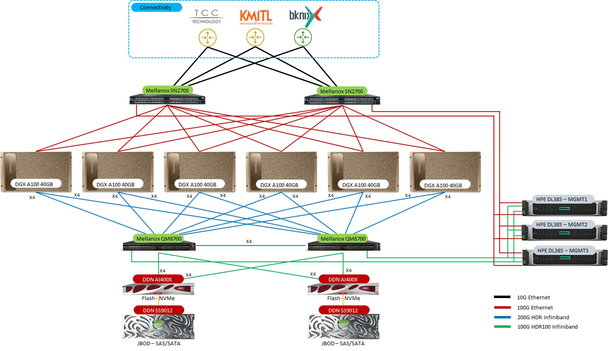

import { Tabs, TabItem } from "@astrojs/starlight/components";
import { LinkCard } from "@astrojs/starlight/components";

## ประวัติความเป็นมา

13 ตุลาคม 2020 - Nvidia ประกาศการติดตั้ง Nvidia DGX POD ระบบใหญ่ในเอเชียตะวันออกเฉียงใต้
โดย Nvidia DGX POD ชุดนี้จะทำหน้าที่เป็นโครงสร้างพื้นฐานของคอมพิวเตอร์ เพื่อขับเคลื่อนงานวิจัยปัญญาประดิษฐ์ (AI)
ที่มหาวิทยาลัยซีเอ็มเคแอล ในประเทศไทย โดยคลัสเตอร์นี้จะเป็นทรัพยากรศูนย์กลางที่เชื่อมต่อกับการวิจัยและ
ทรัพยากรประมวลผลของมหาวิทยาลัยต่าง ๆ ทั่วประเทศไทยเข้าไว้ด้วยกัน

ในฐานะส่วนหนึ่งของโครงสร้างพื้นฐานด้านการวิจัยปัญญาประดิษฐ์ (AI) ของประเทศไทย มหาวิทยาลัยซีเอ็มเคแอลได้มีการจัดตั้ง
คลัสเตอร์คอมพิวเตอร์ที่มุ่งเน้นงานด้านปัญญาประดิษฐ์โดยเฉพาะ เพื่อให้มีความสามารถในการแลกเปลี่ยนข้อมูลและแพลตฟอร์ม
การวิเคราะห์ประมวลผลด้านปัญญาประดิษฐ์ สำหรับการสนับสนุนการสร้างขีดความสามารถในเศรษฐกิจปกติใหม่ สิ่งนี้จะช่วยผลักดันงานวิจัยในหัวข้อต่าง ๆ
เช่น อาหาร การเกษตร การดูแลสุขภาพ และเมืองอัจฉริยะ

---

## ทรัพยากรระบบ

:::tip[APEX AI-HPC]

- 30 PFlop/s AI Performance (FP16)  
- 1920 vCPU compute cores  
- 48x A100 40GB GPUs with 1.92 TB Total GPU Memory  
- 3 PB of high-performance parallel storage  
- 200 Gbps InfiniBand HDR  
  :::

---

### แผนภาพระบบ

### ระบบประมวลผล

- Nvidia DGX A100 (40GB) - 6 nodes

| Components / Node             |                               |
| ----------------------------- | ----------------------------- |
| CPU Model:                    | AMD EPYC™ Rome 7742 @2.25 GHz |
| Number of socket(s):          | 2                             |
| Cores per socket(s):          | 64                            |
| Cores per socket(s):          | 64                            |
| CPU total cores:              | 256                           |
| CPU L3 Cache:                 | 256 MB                        |
| Memory Type:                  | DDR4-3200MT/s ECC RDIMM       |
| Memory total capacity:        | 1024 GB                       |
| Accelerator (GPGPU) Model :   | Nvidia A100 40 GB             |
| Accelerator Unit :            | 8                             |
| Accelerator total Memory :    | 320 GB                        |
| Accelerator Interconnection : | NVLink 3.0 & 6 NVSwitch 2.0   |

### ระบบเครือข่าย

- Nvidia Mellanox InfiniBand HDR 200 Gb/s
- Maximum bandwidth: 1.6 TB/s IB GPU-to-GPU between nodes
- Nvidia Mellanox Spectrum Ethernet 100 Gb/s

### ระบบจัดเก็บข้อมูล

- Total 3 PB of high-performance parallel storage
- 2.2 PB of SAS 12G HDD storage
- 550 TB of NVMe SSD storage

---
